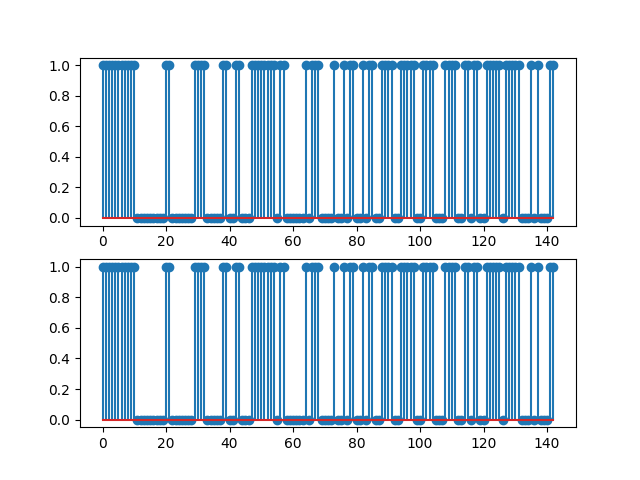
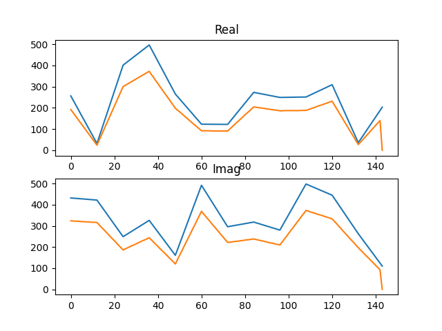
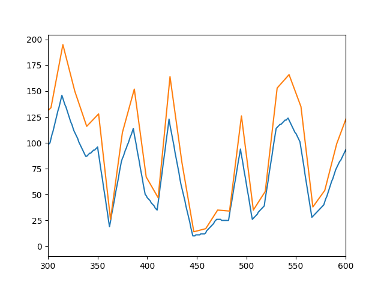
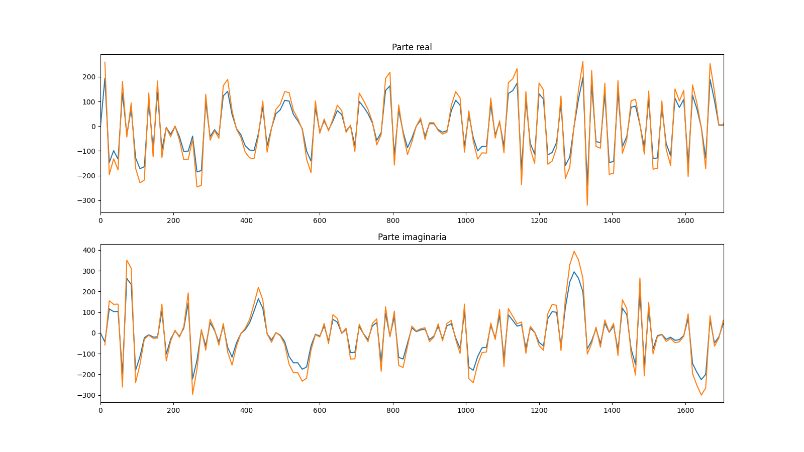
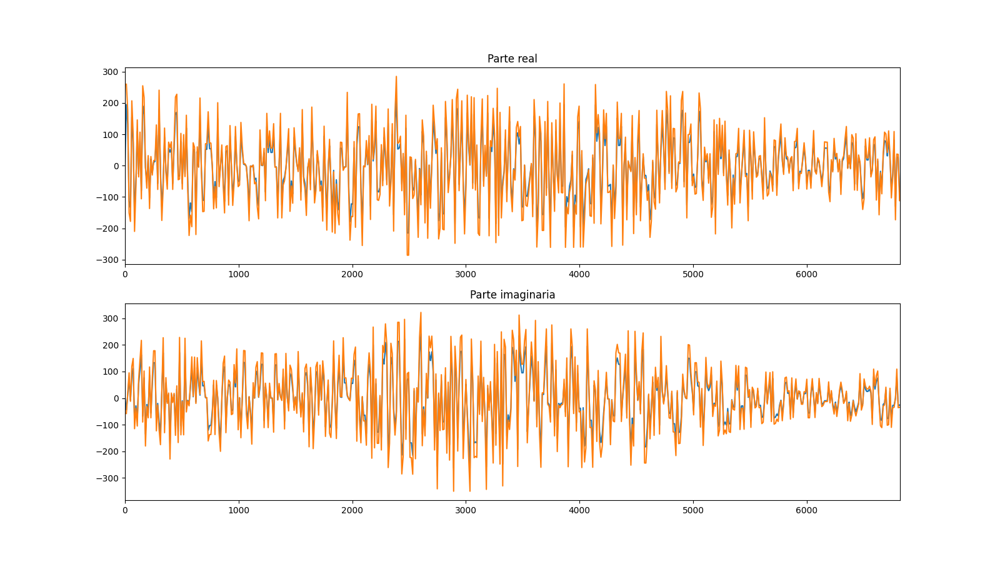
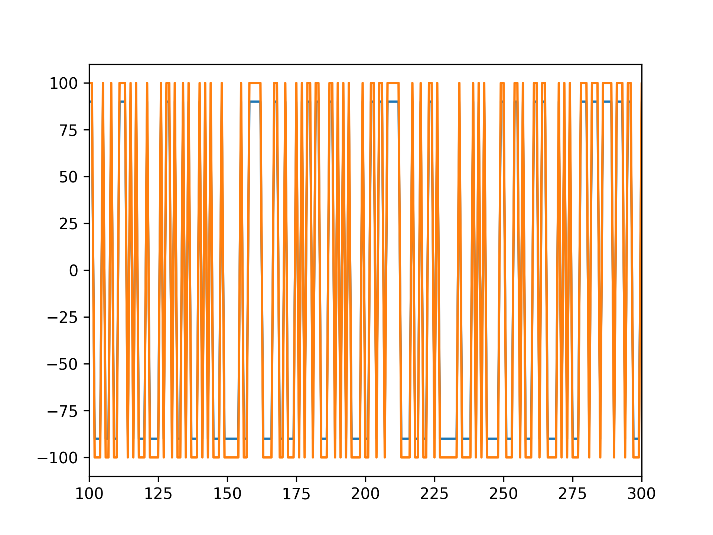
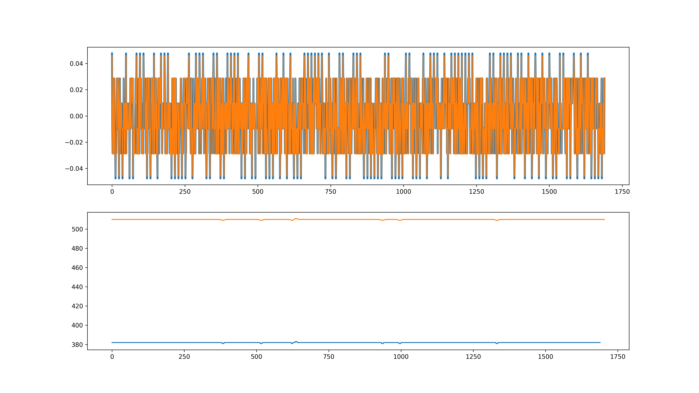
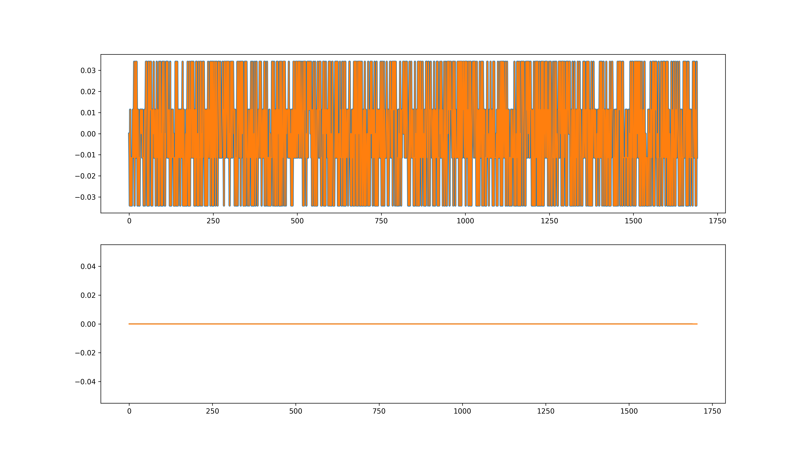
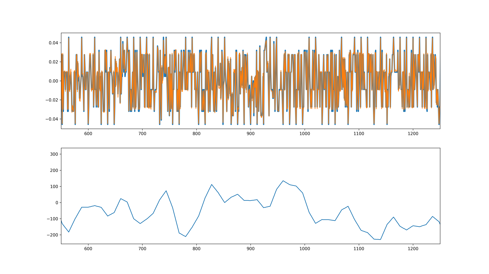
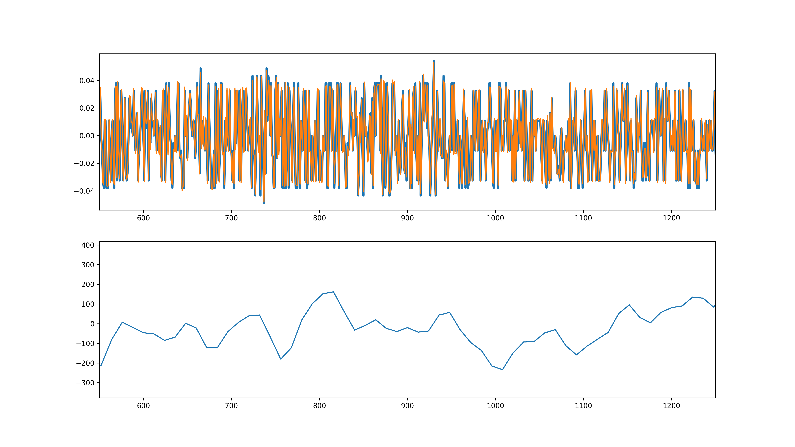

# Introducción

Esta memoria servirá para detallar la funcionalidad de los códigos
usados para la parte sobre programación en VHDL y verificación de la
asignatura \"Electrónica Digital para Comunicaciones\" de 1º de MUIT y
será presentada junto a otra memoria complementaria sobre códigos
Matlab.

Casi la totalidad de los *test benchs* que se presentarán han sido
realizados con la herramienta de *software* libre *CoCoTb* (COroutine
based COsimulation TestBench) mientras que los pocos restantes se han
realizado en VHDL. Se ha elegido CoCoTb para hacer el proyecto debido a
su flexibilidad y su potencial a la hora de realizar simulaciones de
código, mucho mas profunda que los que se pueden realizar en VHDL,
añadiendo a las simulaciones la potencia de las infinitas librerias que
ofrece python para realizar casi cualquier tipo de función.

El proyecto de la asignatura trata de realizar un estimador de canal
enteramente en VHDL y opcionalmente complementarlo con la equalización,
además de realizar verificación del funcionamiento de los códigos
aportados. Esta memoria se estructurará de forma que se mostrarán los
códigos de los bloques principales, con comentarios para explicar su
funcionalidad en el propio fichero, y se darán breves explicaciones en
la memoria de las elecciones de diseño mas relevantes. Primero una
sección hablando del diseño del sistema. Posteriormente se analizarán
los bloques funcionales con pequeños trozos de códigos especialmente
llamativos, para acabar con un resumen de hitos y mejoras. Se añade un
anexo con los códigos tanto de VHDL como de Python para verificar.

# Estimador de canal, diseño de la estructura

En la asignatura se ha propuesto una posible implementación del sistema,
pero en este trabajo se ha optado por diseñar otra desde cero, y dentro
de lo posible mejorarla y añadirle ventajas que la hagan útil para
determinado caso.

De esta manera, se ha desarrollado un esquema en el cual se elimina, con
respecto a la propuesta original, cualquier uso de memorias DRAM y
máquinas de estados, haciendo el sistema más simple y, al no necesitar
estados, más rápido. Esto ha facilitado bastante la programación en
VHDL, pero a coste de dificultad en el diseño, teniendo que salvar
varias trabas tomando enfoques diferentes. De esta forma, se ha logrado
tener el sistema funcionando bajo una arquitectura en *pipeline*,
haciendolo una implementación mucho más eficiente, efectiva y
requiriendo menos dispositivos. En la Figura
[\[implementacion\]](#implementacion){reference-type="ref"
reference="implementacion"} se muestra el diagrama de bloques de está
implementación.


Merece la pena pararse a comentar algunos detalles del sistema que será
de utilidad para la sección posterior, analizando en detalle los
bloques. Las entradas del sistema, como en la propuesta, son los datos
como números complejos y la señal bandera *y_valid* que indica cuando
estos datos son nuevos. Aquí se encuentra una de las primeras (y
principales) desventajas de trabajar con *CoCoTb*, la cual es el no
poder usar datos de tipo *record*, lo cual aporta bastante limpieza y
simplicidad al código, así que todas las señales que representen valores
complejos estarán separadas en real e imaginaria.

Sobre el funcionamiento del sistema en conjunto, para empezar se
asumirá, como en Matlab, que el primer piloto es la primera muestra del
símbolo. La secuencia de datos comenzará a mover el sistema, haciendo
que el contador tome el valor inicial 0, al estar cargado con el valor
de *reset* 11, de manera que piloto y valor del contador 0 vayan al
unísono. Los circuitos combinacionales controlarán la señal de
activación para los bloques FSM y PRBS, donde la segunda irá un ciclo de
reloj por delante, para que el PRBS tenga tiempo a calcular el siguiente
signo. En el bloque FSM se calculará la h estimada según
$h_{estimada} = \pm Y$ dependiendo del valor del signo y por un proceso
se asignarán los valores de los pilotos correspondientes. Para acabar,
el bloque interpolador recibirá las señales h del bloque FSM en conjunto
con el dato *valid*, el cual avisará de cuando debe funcionar el bloque.
Las salidas pues, serán estimación real e imaginaria del canal en ese
ciclo y una bandera indicando si es un dato nuevo.

Los bloques *Delayer* que se encuentran dispersos por la aquitectura del
estimador sirven para compensar los retardos ocasionados por los
circuitos no combinacionales, a parte de servir para asegurar en un caso
de implementación real que los retardos en las puertas lógicas no
afecten a nuestro circuito.


En la Figura [\[delays\]](#delays) se muestra sobre el diagrama original como afectan
los bloques síncronos al diseño. Como se ha comentado, al ser
*pipeline*, y con un flujo de datos constante, los valores de salida se
procesarían continuamente y saldría con un retraso de tres periodos de
reloj tras la entrada del primer dato.

Para acabar, resta comentar el añadido del ecualizador. Este ha sido
realizado mediante divisiones combinacionales para aprovechar la
arquitecura en serie que se ha usado y continuar con la filosofía de
trabajo de intentar mantenerlo lo más simple posible.


Lo más relevante que debe ser comentado sobre este diseño es el hecho de
que las primeras 12 estimaciones del estimador de canal serán inútiles,
ya que corresponden a una interpolación entre el primer piloto y el
valor de *reset*, por lo que los datos deben entrar en el ecualizador
retrasados 12 ciclos debido a este hecho más los 3 que tarda en realizar
sus procesos.

# Análisis de los códigos

En esta sección se verán en detalle los códigos VHDL usados y los *test
benchs* para verificarlos uno a uno, dando enfásis en las partes más
importantes. Para una mayor claridad, los códigos de VHDL estarán
resaltados en azul y los de Python en negro.

## Contador

El contador es un bloque muy simple, el cual contará de 0 a 11 para
señalar cuando viene un piloto. Lo más interesante es el generic para
controlar su valor de inicio, usado para poder en fase al contador con
los pilotos. Es habilitado por la señal de dato válido.

``` {.vhdl .numberLines linenos="true" bgcolor="colorVHDL" frame="single" breaklines="true"}
entity contador1_12 is
    -- Generic defines beginning value for counter, in case is needed an uncommon start
    generic (
    start : integer := 11
    );
    port (
    rst    : in  std_logic;
    clk    : in  std_logic;
    ena    : in  std_logic;
    cuenta : out unsigned(3 downto 0)
    );
end contador1_12;
```

En cuanto a su verificación, ha sido realizada una muy simple para
comprobar su correcto funcionamiento. Aún así, es intersante echarle un
ojo para comentar algunas bases de *CoCoTb* que se usarán en muchos
*testbenchs*.

``` {.python .numberLines linenos="true" bgcolor="negro" frame="single"}
import cocotb
from cocotb.triggers import Timer
from cocotb.triggers import RisingEdge
import matplotlib.pyplot as plt
import numpy as np
# import oct2py
```

Un ejemplo de las librerías que se usarán, donde destaca cocotb, que es
la principal. Por otro lado está matplotlib.pyplot para gráficas, numpy
para operar con vectores y oct2py para mover códigos matlab.

``` {.python .numberLines linenos="true" bgcolor="negro" frame="single"}
maxCycles = 120
currentCycle = 0

async def generate_clock(dut):
    """Generate clock pulses."""
    global maxCycles,currentCycle
    for cycle in range(maxCycles):
        dut.clk.value = 0
        await Timer(1, units="ns")
        dut.clk.value = 1
        await Timer(1, units="ns")
        currentCycle += 1
```

Este trozo de código define variables globales para el número máximo de
ciclos y el ciclo actual. Mientras tanto en la función se define el
ciclo de reloj y se aumenta este valor de la variable para seguirla por
todo el prograna.

``` {.python .numberLines linenos="true" bgcolor="negro" frame="single"}
@cocotb.test()
async def test1(dut):
    global maxCycles,currentCycle
    values = []
    await cocotb.start(generate_clock(dut))

    dut.rst.value = 1

    await RisingEdge(dut.clk)

    dut.ena.value = 1
    dut.rst.value = 0

    while currentCycle < maxCycles-1:
        await RisingEdge(dut.clk)
        values.append(int(dut.cuenta))

    print(values)
```

Para acabar el test en sí, primero se definen las variables, se le da el
reset y se deja aumentar el clk con la sentencia Await RisingEdge. Este
será el bucle principal del *testbench*, donde se tocará la mayor parte
de las cosas.

## Delayer

Este bloque también es muy sencillo pero merece comentarse aún así. Ha
sido verificado con gtkwave en conjunto con el estimador por lo que no
se muestra su *test bench* aquí. Su funcionamiento se basa en generar
biestables para todos los bits de los datos y dárselos de entrada al
bloque FSM.

## PRBS

Bloque para la generación del código pseudo aleatorio para los pilotos.
Es bastante directo hacer este bloque partiendo del contador. Algunos
detalles interesantes son: el bloque principal, donde hubo problemas de
compilación al no especificar a ghdl mediante el makefile de CoCoTb la
versión del VHDL deseada.

``` {.vhdl .numberLines linenos="true" bgcolor="colorVHDL" frame="single" breaklines="true"}
process (reg)
begin
    -- not working till GHDL_ARGS ?= --std=08 is used in GHDL compiler from cocotb (thanks to @hipolitoguzman)
    preg <= (11 downto 2 => reg(10 downto 1), 1 => reg(11) xor reg(9));
    
    -- workaround
    -- preg(11 downto 2) <= reg(10 downto 1);
    -- preg(1) <= reg(11) xor reg(9);
end process;
```

También es interesante el valor de inicio del PRBS, el cual no coincide
con el dicho en el estándar, que es todo 1's. Esta inicialización es así
debido a que es necesario retrasar los signos del PRBS un ciclo, y así
se consigue sin modificar la secuencia futura, consiguiendo que sea
totalmente compatible con un sistema DVBT.

``` {.vhdl .numberLines linenos="true" bgcolor="colorVHDL" frame="single" breaklines="true"}
process (clk,rst)
begin
    if rst = '1' then
    -- indexin n slicin
    reg <= (11 => '0',10 => '1', others => '1');
    elsif rising_edge(clk) then
    if ena = '1' then
        reg <= preg;
    else
        reg <= reg;
    end if;
    end if;
end process;
```

En un principio se tuvo en cuenta que el PRBS solo se activaba cada doce
ciclos, cuando no es así. Esto fue fácilmente modificado para respetar
el estándar cambiando el bloque combinacional de habilitación del PRBS,
dependiendo directamente del dato válido y no del contador.

Respecto al *testbench*, se han realizado dos, uno muy básico para ver
los signos, y otro más interesante en el cual se usa la librería oct2py
para comparar con el código Matlab.

``` {.python .numberLines linenos="true" bgcolor="negro" frame="single" breaklines="true"}
from oct2py import octave
goldenSignos = octave.PRBS(1,1705)
goldenSignos = (goldenSignos[0,:]+1)/2
# dut._log.info(signos)
dut._log.info(goldenSignos.shape)
# print(goldenSignos.shape)

plt.subplot(211)
plt.stem(signos)
plt.subplot(212)
plt.stem(goldenSignos)
plt.show()
```

Llama la atención como se accede fácilmente a la función previamente
definida PRBS.m, como se tratan los datos y los plots. Además se usa
dut.\_log.info para escribir en el logger con el nivel de altera
\"info\".




## FSM

El bloque FSM se llama así por que en las primeras etapas del diseño del
funcionamiento del sistema iba a ser una máquina de estados, pero al
final se consiguió simplificar tanto que se convirtió en un circuito
síncrono sin estados, y conservó ese nombre como bloque. Su función es
la de recibir los pilotos y el signo del generador PRBS para así estimar
el valor de h. Para esta función deberá, cada vez que venga un piloto,
cambiar el piloto servido como superior al interpolador por el inferior
y añadir el nuevo que llega como inferior.

Básicamente es un circuito síncrono que se encarga de cuando le llega la
señal *write_enable* cambiar los valores de las h estimadas superior e
inferior, cambiandoles el signo si es necesario según el valor del signo
arrojado por el bloque PRBS.

``` {.vhdl .numberLines linenos="true" bgcolor="colorVHDL" frame="single" breaklines="true"}
-- changing sign depending on PRBS
if PRBS = '1' then
    p_h_sup_re <= piloto_y_re;
    p_h_sup_im <= piloto_y_im;
    p_h_inf_re <= h_sup_re;
    p_h_inf_im <= h_sup_im;
else
    p_h_sup_re <= -piloto_y_re;
    p_h_sup_im <= -piloto_y_im;
    p_h_inf_re <= h_sup_re;
    p_h_inf_im <= h_sup_im;
end if;
```

Por dentro tiene poca lógica, solo destacar el if decidiendo como cambia
el signo de los pilotos según el valor del PRBS. El resto del código es
un circuito síncrono común.

En verificación se ha estudiado si realmente obtiene los pilotos en el
momento correcto y no en cualquier otro. Para esto se ha pasado el valor
de entrada 69 en todos los instantes incorrectos, mientras que en los
slots de los pilotos se pasa $10 + i*5$ para la parte real y
$100 + i*10$ a la imaginaria para comprobar que correctamente aumentan
los valores, es decir, cambian cada doce ciclos.

Si por alguna razón toma valores incorrectos, es decir, 69, salta una
excpeción.

``` {.python .numberLines linenos="true" bgcolor="negro" frame="single" breaklines="true"}
# try avoids int(XXX) or int(uuu) case
# this could be avoided by cocotb's 
# resolve u, which would change u bit values to
# one at our choice, but we would lose some sight of 
# what is happening.
try:
    int(dut.inf_re.value)
    int(dut.inf_im.value)
    int(dut.sup_re.value)
    int(dut.sup_im.value)
except:
    pass
else:
    # if pilots values are correctly casted into int, check if they got wrong values (samples values are represented by 69)
    if dut.inf_re.value == 69 or dut.inf_im.value == 69 or dut.sup_re.value == 69 or dut.sup_im.value == 69:        
        raise "El valor incorrecto ha sido propagaddo!"
```

Aquí ya hay varios temas interesantes. Para empezar el la estructura try
-\> except -\> else, sobretodo para realizar posteriormente el \"try
trick\" que se explicará luego. Si el valor de los pilotos es
incorrecto, salta la excepción.

Es uno de los primeros *testbenchs* donde todavía estaba aprendiendo a
manejarme, un tema importante es que si quieres pasar las variables de
vhdl a python y en vhdl valen U o X habrá problemas graves. CoCoTb puede
resolver automaticamente estos valores a 0 o 1, pero eso le restaría
algo de fiabilidad a las verificaciones así que decidí ignorarlo.

## Interpolador

Este bloque es el original que fue aportado para el trabajo de la
asignatura pero **no** es el usado finalmente para la implementación,
pero se proporciona también al haber realizado una verificación de este.

La verificación es bastante interesante ya que ha sido realizado un
*test bench* que contrasta contra datos generados aleatoriamene usando
una arquitectura *self-checking*. Estos datos posteriormente se grafican
para ser comparados.

``` {.python .numberLines linenos="true" bgcolor="negro" frame="single" breaklines="true"}
inf_re = int(np.round((np.random.rand())*2**9))
inf_im = int(np.round((np.random.rand())*2**9))
sup_re = int(np.round((np.random.rand())*2**9))
sup_im = int(np.round((np.random.rand())*2**9))
```

Así se generan fácilmente valores aleatorios como entradas. Para
comparar si interpola bien en este caso se ha comparado con un predictor
hecho en Python y no en matlab para mostrar la amplia gama de opciones a
la hora de comprobar el funcionamiento del circuito, aunque aquí no se
exploren demasiadas hay muchas más.



Se puede ver como las formas de onda aleatorias son exactamente iguales
pero ligeramente escalada una respecto a otra.

## InterMig

Este es el interpolador que se usó finalmente para el proyecto. Se
modificó para que cumpliera dos requisitos fundamentales, uno de ellos
que tardara menos en interpolar, ya que el proporcionado tardaba trece
por cada doce datos, lo cual arruinaba la arquitectura *pipeline*,
mientras que el otro requisito fue el que la señal valid tuviera que
estar valiendo 1 en cada ciclo para que la interpolación se realizara.
Esto último es debido a que si en algún momento dejaran de entrar datos,
todo el sistema debe pararse a la vez, si la interpolación siguiera
habría incompatibilidad entre partes. Los cambios realizados son
pequeños y dispersos por lo que no se mostrará nada en concreto del
código VHDL. Los objetivos nombrados se lograron cambiando el *reset* y
la señal de dato válido.

En el *testbench* correspondiente, el cual es una modificación de la
primera versión del interpolador original, se realizan dos tests en un
mismoa archivo por primera vez en la memoria, lo cual se comentará
luego, además de que se prueba el reset.

## AllButInterpolator

Este código implementa todo los bloques menos el interpolador para
comprobar que en conjunto todo va bien. Hubo un momento en el que las
cosas fallaban y se comprobó el funcionamiento de los subbloques poco a
poco para asegurar. Detalles intersantes de este bloque también se ven
en TopLevel, así que se dejarán para esa parte al ser más improtante.

Las pruebas de este bloque fueron muy sencillas, solo para comprobar sus
correctas conexiones. *Testbench* también basado en el del interpolador
original.

## TopLevel (Estimador)

Esta unidad se encarga de conectar los anteriores bloques de la forma
descrita en el primer apartado para lograr su correcto funcionamiento.
Se define también como un proceso síncrono el retraso de la señal de
dato válido para ser utilizado en otros bloques. Aquí se ven las
sentencias que sintetizarían los bloques de habilitación de FSM y PRBS:

``` {.vhdl .numberLines linenos="true" bgcolor="colorVHDL" frame="single" breaklines="true"}
-- adding "and y_valid_delayed" becouse if we stop and cuenta value is 11 we get many prbs
-- enaPRBS <=  '1' when (cuenta_value = "1011" and y_valid_delayed_1 = '1')  else '0';
-- hpgm didnt like PRBS the way i did it, fixed
enaPRBS <=  '1' when (y_valid_delayed_1 = '1')  else '0';

-- same with FSM
enaFSM <=  '1' when (cuenta_value = "0000" and y_valid_delayed_2 = '1') else '0';
```

Se cambió aquí el comentado error en el PRBS. También se tiene en cuenta
el valor de dato válido y no solo el del contador para la problmática
descrita en el comentario, cuando el sistema para y el contador se queda
parado en cierto valor conflictivo (en su momento 0000 o 1111, después
del cambio del PRBS solo 0000).

En cuanto al *test bench*, se realizan varios tests, uno incial general,
otro para comprobar el *reset*, y los siguientes para los modos 2k y 8k.
Para seleccionar cuales se quieren usar se hace uso de las variables
globales skipn, de la siguiente forma:

``` {.python .numberLines linenos="true" bgcolor="negro" frame="single" breaklines="true"}
skip1 = True
skip2 = True
skip3 = False
skip4 = True

@cocotb.test(skip = skip1)
async def testIfWorks(dut):
    ...
```

Dando el valor False para ejecutar (no skip) y true para no ejecutar
(skip). Adicionalmente, se define la función *fromsigned2int* para
recuperar los datos en formato signed20 a los integer de Python. Luego,
al ver largos tiempos de computación se buscaron alternativas para
agilizar el cómputo, llegando a la función versión 2, que reduce a más
de la mitad el tiempo de procesado.

``` {.python .numberLines linenos="true" bgcolor="negro" frame="single" breaklines="true"}
def fromsigned2int(bits,base):
    v = base**np.arange(bits.shape[1],0,-1)
    v[0] = -v[0]
    return np.sum(bits*np.kron(np.ones((bits.shape[0],1)),v),axis=1)

# much much faster (halves time to compute)
def fromsigned2intv2(bits):
    return np.array([value.signed_integer for value in bits])
```

Otro detalle es el hecho de usar cierta configuración de
matplotlib.pyplot usada para el modo *headless*, esto será útil para la
integración continua con Docker, acelerando el computo al no necesitar
mostrar la gráfica. Esta opción se activa así:

``` {.python .numberLines linenos="true" bgcolor="negro" frame="single" breaklines="true"}
import matplotlib
matplotlib.use('Agg')
```

La estrucutra en sí del *testbench* es muy interesante, destacando el
uso de octave.addpath para añadir la carpeta de los códicos Octave al
directorio de trabajo y el escalado de las muestras.

Para acabar, algunas gráficas arrojadas por el programa:




Aquí se puede ver como los pilotos en conjunto con todo el circuito
funcionan bien. Pasando a interpolación está el modo 2k:



Y en el modo 8k:



## Ecualizador

El bloque final es el equalizador de canal, el cual se encarga de
dividir las muestras $y$ entre el canal estimado $h$ para revertir los
efectos del canal. Esta operación se ha propuesto como un circuito
combinacional, haciendo uso del operador $\backslash$ para realizar la
división combinacional, lo cual consume mucha área pero permite que el
diseño conserve su estructura *pipeline*. También habría que, en el
diseño real, fijarse en el tiempo que tardan todas esas puertas lógicas
en realizar las operaciones, pero al ser simulación funcionará, por lo
que en una implementacion se dejaría la comprobación del correcto
funcionamiento físico. Los resultados se escalan por $2^{10}$ gracias a
un desplazamientopara realizar la división. Este factor de escala luego
se corrije.

La división y multiplicación está definida según la multipliación
compleja

$$% \label{eq1}
    \begin{split}
        (a + j b) (c +j d) &= (e + j f) \\
                        e  &= a c + b d \\
                        f  &= b c - a d
    \end{split}$$

Posteriormente este valor se dividirá entre el módulo de la h estimada.

El *test bench* del bloque es extremadamente sencillo, ya que se
simulará posteriormente en conjunto con todo el sistema, así que solo se
realizaron comprobaciones leves.

## Registro

A parte del ecualizador otro bloque más será necesario para el correcto
funcionamiento de todo el sistema. Como se comentó al principio, entre
los doce ciclos que hay que esperar para que el interpoladro arroje
valores válidos y los tres ciclos de reloj de retardo, la señal $y$ de
entrada al ecualizador tendrá que retrasarse, eso es lo que hará este
bloque.

Lo más importante en mi opnión es la definición del tipo array para
crear el registro, de esta manera:

``` {.vhdl .numberLines linenos="true" bgcolor="colorVHDL" frame="single" breaklines="true"}
type reg is array (0 to delay-1) of signed(9 downto 0);
signal p_regis,regis : reg := (others => (others => '0'));
```

Para verificar el registro se generan valores enteros incrementando a
cada ciclo su valor en 1 unidad, para comprobar en gtkwave que los
valores avanzan correctamente por el registro.

## Sistema completo

Este último código tiene de tarea fundamental unificar todos los
bloques, dando lugar al sistema por completo. Solamente instancia el
estimador, el cual reunía todos los demás bloques, el ecualizador y el
registro.

Es un código bastante limpio ya que solo instancia componentes,
conectándolos entre ellos.

En cuanto a verificar, se realizan cinco *tests* de forma similar al
estimador, uno inicial, otro del reset, un modo 2k contra un canal plano
y posteriormente para los modos 2k y 8k, otra vez contra Matlab, todo
bajo el *engine* de Octave.

Para empezar, se usarán varias figuras de mérito:

``` {.python .numberLines linenos="true" bgcolor="negro" frame="single" breaklines="true"}
def MSE(x,y):
    return 10*np.log10((norm(x-y)/len(x)))

# using norm instead of mean square
def RMSE(x,y):
    return 10*np.log10(np.sqrt((norm(((x-y)))/len(x))))

def MAE(x,y):
    return np.mean(np.abs(x-y))
```

Las figuras serán usadas con sus argumentos normalizados, MSE y RMSE
serán encargadas de medir el parecido de las señales de salida mientras
que el MAE calculará el error absoluto.

En el primer test se generan datos aleatorios. No hay nada muy
importante que comentar del código pero será la base de los siguientes
puesto que integra muchas cosas pequeñas que en conjunto logran un test
robusto.

En el primer test se ecualiza en un canal plano con datos aleatorios.
Los resultados son muy cercanos a ser perfectos, donde se obtienen unos
resultados muy buenos:


  *M.F.*  |  **MSE \[dB\]** |  **RMSE \[dB\]** |  **MAE**
  --------- ---------------- ----------------- --------------------
  Real     | $-\inf$          |$-\inf$           |$0$
  Imag     | $-185.6$         |$-92.8$           |$6 \cdot 10^{-18}$
  Complex  | $-188.6$         |$-94.3$           |$3 \cdot 10^{-18}$





En esta última figura se muestra los datos ecualizados contra Matlab y
la estimación del canal. Los datos equalizados están normalizados, y a
la salida del VHDL, en azul, se le ha aplicado un pequeño factor de
escala para verla bien con respecto a la de Matlab.

Por otro lado está el *test* del reset que hace una comprobación muy
simple. Este test se ha implementado anteriormente, simplemente para
asegurar su correcto reinicio. Se genera un canal aleatorio para su
comporbación.

Pasando directamente al tercero, que ya es más interesante, donde se
compara contra Matlab sin introducir canal, a ver que tal es el
rendimiento. En este caso se usa un símbolo 2k y se prueban distintas
modulaciones.

Es bastante interesante ya que trabaja con el archivo de Matlab,
aprovechando la parametrización, desactivando el canal y creando un caso
ideal.

Otra vez es un código que se apoya mucho en los anteriores, donde lo más
relevante es la inclusión de una excpeción para fallar el test en el
caso de que los resultados no sean los esperados. En este caso se ha
fijado -20dB de MSE, un valor aceptable. Esta variable se incluirá en
los demás, tanto de canal DVBT con o sin ruido para avisar cuando se
haga CI de si algo se ha roto.

``` {.python .numberLines linenos="true" bgcolor="negro" frame="single" breaklines="true"}
if MSEcomplex >= -20:
    raise NameError("El error es mayor que el límite establecido, %d > -20 dB" % MSEcomplex)
```


  *M.F.* |  **MSE \[dB\]**  | **RMSE \[dB\]**  | **MAE**
  -------- ---------------- ----------------- ----------------------
  BPSK     |$-59.5$          |$-29.7$           |$4.3 \cdot 10^{-5}$
  QPSK     |$-61$            |$-30.5$           |$2.25 \cdot 10^{-5}$
  16QAM    |$-61$            |$-29.7$           |$2.3 \cdot 10^{-5}$

Hay una interesate interración y es que si el canal es absolutamente
plano, en ausencia de ruido y la parte real o imaginaria valen cero,
caso que se cumple para BPSK, canal plano y sin ruido, el sistema
diverge al estimar el canal, por lo que se les ha añadido ruido a todos
los experimentos de la tabla para hacerlo más justo, $SNR = 60$. Se
puede ver como aún así, el error sale en la BPSK algo peor.






Un par de cosas importantes a notar en estas dos figuras
[\[eqmatlabflatre\]](#eqmatlabflatre) y
[\[eqmatlabflatim\]](#eqmatlabflatim). La primera es que el canal en la parte real
arroja valores, mientras que en el imaginario es cero. Esto tiene
sentido, ya que si el canal es plano su parte real valdrá una constante,
y su parte imaginaria 0. A su vez, en la parte real aparecen unos picos,
estos son los pilotos, que al ser equalizados vuelven a tener valores
reales, por lo que no aparecen en la segunda gráfica.

Pasando ya al canal de DVBT, es muy parecido al código del canal plano,
pero activando el canal. Se obtienen estos valores:


  *M.F.*   |  **MSE \[dB\]** |  **RMSE \[dB\]** |  **MAE**
  ---------- ---------------- ----------------- ----------------------
  BPSK 2k    |$-37.6$          |$-18.8$           |$5 \cdot 10^{-3}$
  QPSK 2k    |$-44.5$          |$-22.26$          |$1.25 \cdot 10^{-3}$
  16QAM 2k   |$-43.8$          |$-21.9$           |$1.4 \cdot 10^{-3}$
  BPSK 8k    |$-40$            |$-20$             |$2 \cdot 10^{-3}$
  QPSK 8k    |$-51.8$          |$-25.9$           |$1 \cdot 10^{-4}$
  16QAM 8k   |$-52.3$          |$-26.3$           |$1\cdot 10^{-4}$

donde no se ha añadido ruido.






  *M.F.*   |  **MSE \[dB\]**  | **RMSE \[dB\]**  | **MAE**
  ---------- ---------------- ----------------- ---------------------
  BPSK 2k    |$-37.5$          |$-18.75$          |$5 \cdot 10^{-3}$
  QPSK 2k    |$-44.5$          |$-22.25$          |$1 \cdot 10^{-3}$
  16QAM 2k   |$-43.6$          |$-21.8$           |$1.5 \cdot 10^{-3}$
  BPSK 8k    |$-40.5$          |$-20.3$           |$1.7 \cdot 10^{-3}$
  QPSK 8k    |$-51.9$          |$-25.9$           |$1 \cdot 10^{-4}$
  16QAM 8k   |$-48.8$          |$-24.4$           |$2 \cdot 10^{-4}$


En este caso los resultados son muy similares otra vez, lo cual es
lógico. La BPSK tiene peor rendimiento al estar considerando la parte
imaginaria que tiene bastante más error que la real.

## Integración continua

En el fichero de integración continua se encuentran las llamadas a todos
los tests que se mueven desde la imagen docker en los runners dedicados
en la universidad. Todos pertenencen al mismo *stage*, *test.*

Un ejemplo puede verse en la parte dedicada al sistema completo, con
ecualizador.

``` {.yaml .numberLines linenos="true" frame="single"}
test_full:
  stage: test
  image: registry.gitlab.com/hgpub/fosshdl-dist:edc
  script:
    - cd Linux/Trabajo/FullSystemCCTb
    - make
  artifacts:
    when: always
    paths:
      - Linux/Trabajo/FullSystemCCTb/results.xml
      - Linux/Trabajo/FullSystemCCTb/imgs/eq.png
      - Linux/Trabajo/FullSystemCCTb/imgs/eq_rst.png
      - Linux/Trabajo/FullSystemCCTb/imgs/vsOctave2.png
      - Linux/Trabajo/FullSystemCCTb/imgs/vsOctave8.png
      - Linux/Trabajo/FullSystemCCTb/imgs/estimacioncanalyeq.png
    reports:
      junit:
        - Linux/Trabajo/FullSystemCCTb/results.xml
```

A parte del fichero xml con los resultados de los test se extraen
imágenes por si ha habido error poder ver directamente más información.

## Makefiles

Ha sido pasado por alto pero para hacer uso de CoCoTb es necesario
manejar los Makefiles, los cuales podian ser usados a través de Teros
posteriormente.

Un makefile de ejemplo puede ser este, para el estimador:

``` {.bash .numberLines linenos="true" frame="single"}
#  Makefile

# defaults
SIM ?= ghdl
TOPLEVEL_LANG ?= vhdl

VHDL_SOURCES += $(PWD)/../interpolatorMig.vhd
VHDL_SOURCES += $(PWD)/../PRBS.vhd
VHDL_SOURCES += $(PWD)/../delayer.vhd
VHDL_SOURCES += $(PWD)/../contador1_12.vhd
VHDL_SOURCES += $(PWD)/../FSM.vhd
VHDL_SOURCES += $(PWD)/../toplevel.vhd

# VHDL_SOURCES_lib += $(PWD)/../edc_common.vhd

# version of GHDL
GHDL_ARGS ?= --std=08

# TOPLEVEL is the name of the toplevel module in your Verilog or VHDL file
TOPLEVEL = toplevel

SIM_ARGS +=--wave=tb_toplevel.ghw

# MODULE is the basename of the Python test file
MODULE = tb_toplevel

# include cocotb's make rules to take care of the simulator setup
include $(shell cocotb-config --makefiles)/Makefile.sim
```

# Resumen hitos realizados

Recogiendo todo lo mencionado anteriormente, se han realizado las
siguientes tareas:

-   Diseño de estimador de canal OFDM desde cero con arquitectura
    *pipeline* y retraso de solo tres ciclos de reloj.

-   Depuración de códigos mediante la herramienta GtkWave y gráficas con
    pyplot.

-   Verificación de todos los bloques usados y algunos extra que
    finalmente no se emplearon.

-   Uso de CoCoTb para la mayor parte de la verificación VHDL.

-   Aprovechamiento de la potencia de los *Test Benchs* en Python para
    hacer uso de herramientas como *Matplotlib* u *Oct2Py*.

-   Uso de Integración Continua (CI) mediante GitLab soportado por
    Docker con extracción de información variada.

-   GitLab cuidado y memorias en formato README.md para leerse desde el
    propio GitLab.

## Tests realizados

-   Test contador

-   PRBS

    -   Test básico

    -   Test contra Matlab

-   Test FSM con alerta

-   Test Interpolador con datos aleatorios contra Python

-   Test Interpoladro Mig doble con reset

-   Test AllButInterpolator

-   TopLevel Estimador

    -   Test pilotos incial

    -   Test reset

    -   Test interpolación símbolos 2k

    -   Test interpolaciín símbolos 8k

-   Test ecualizador

-   Test Registro

-   Sistema completo

    -   Test canal plano entradas random

    -   Test reset

    -   Test matlab canal plano ruidoso 2k (varias modulaciones)

    -   Test matlab canal DVBT 2k (varias modulaciones)

    -   Test matlab canal DVBT 8k (varias modulaciones)

    -   Test matlab canal DVBT 2/8k ruidoso (varias modulaciones)

